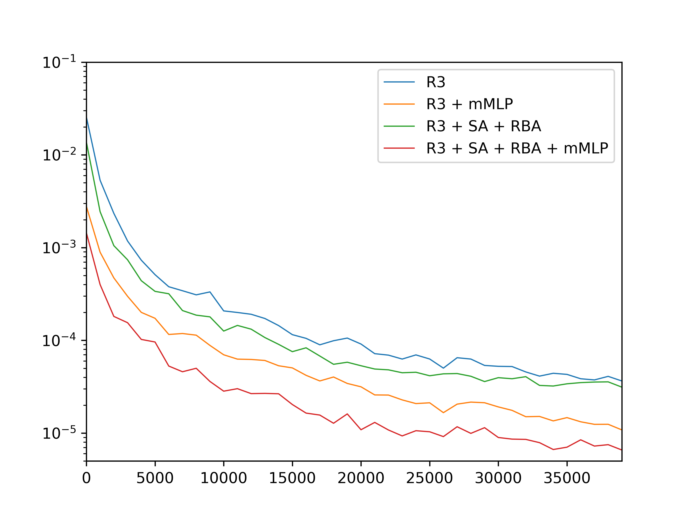
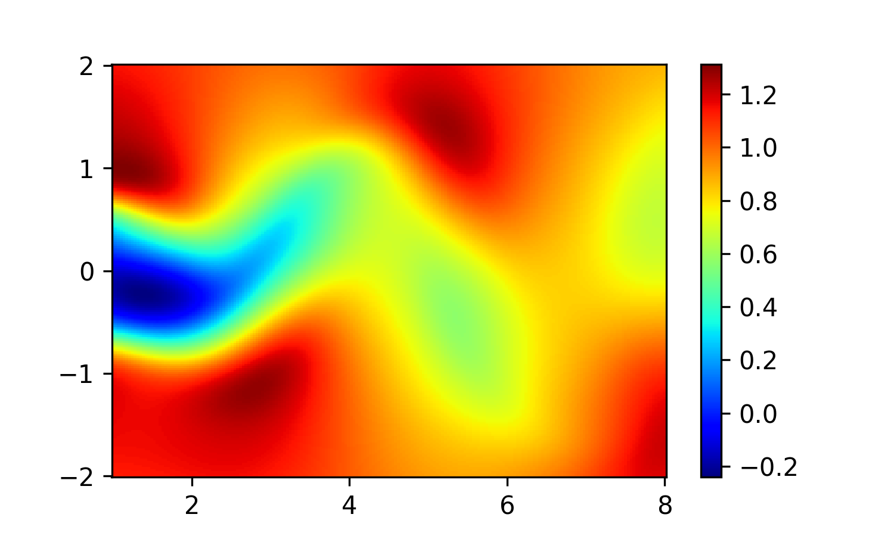
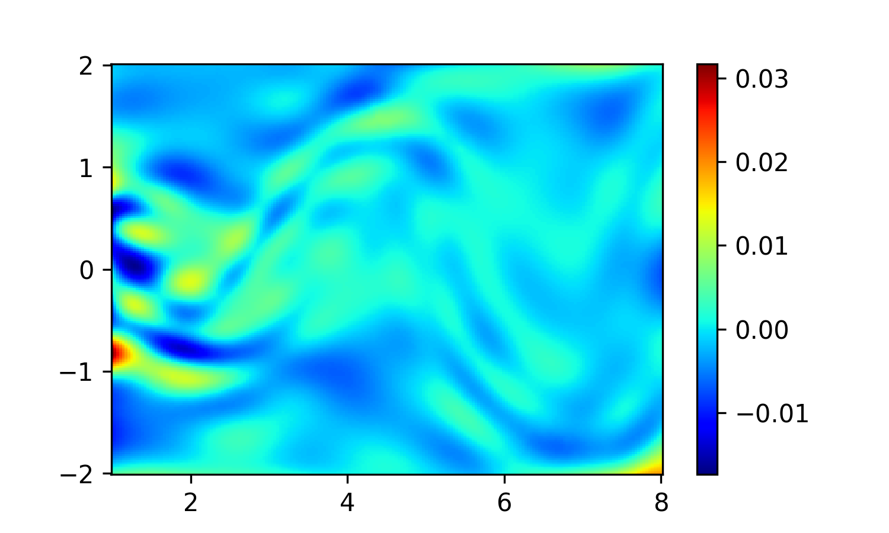
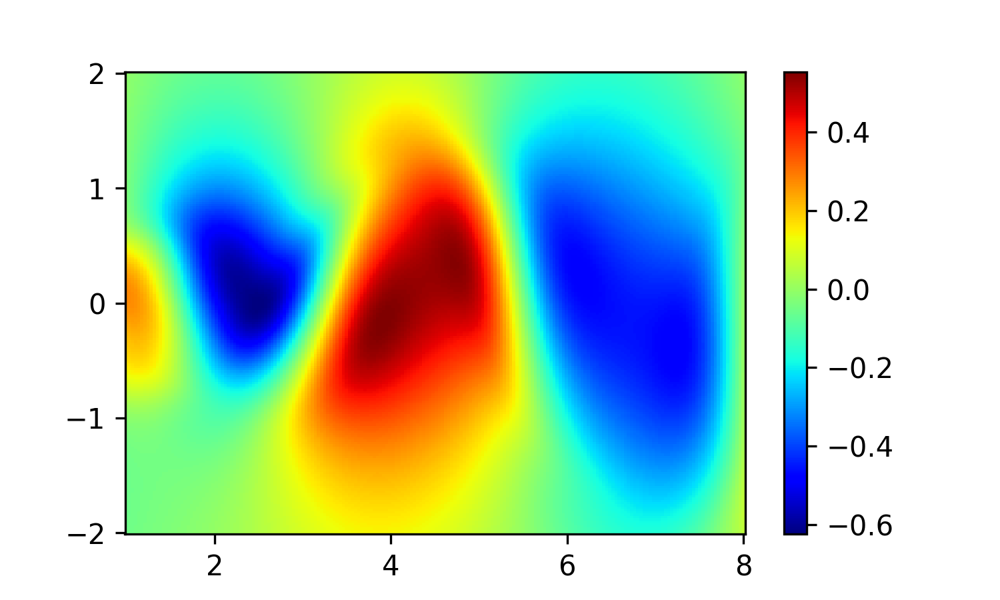
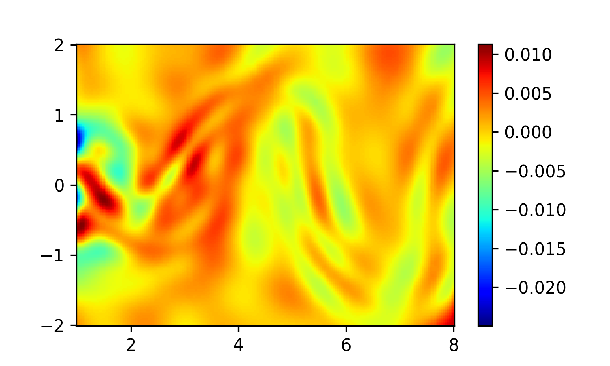
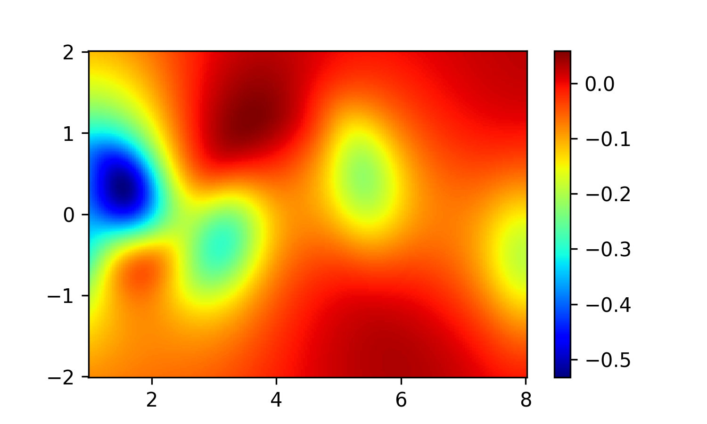
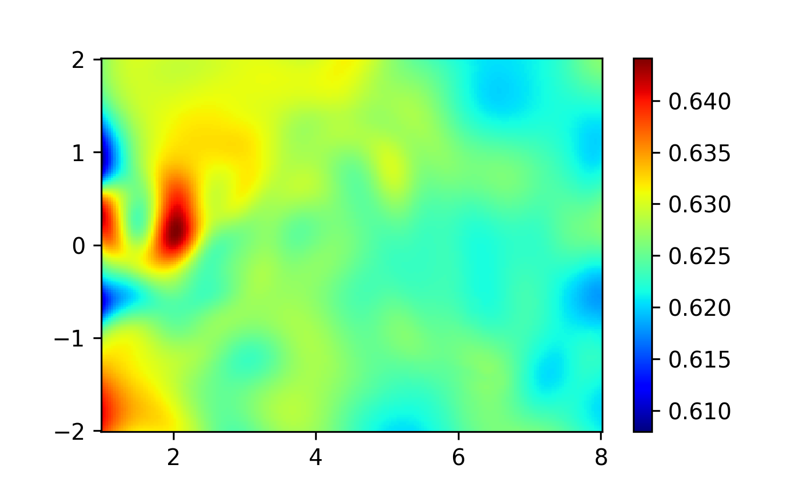

# Accelerated Training Methods of Physics-Informed Neural Networks(PINNs)

The repository contains the implementations of the graduation design(thesis) entitled “Accelerated Training Methods of Physics-Informed Neural Networks” by Yuxin Hao. 

Physics-Informed Neural Networks (PINNs) is an innovative approach that combines deep learning techniques with classical physical laws. These neural networks not only rely on traditional data-driven learning but also incorporate prior knowledge of physical fields into their loss functions. This allows PINNs to solve a wide range of complex physical problems, even with very limited observational data or no data at all, demonstrating broad application potential. However, in practical applications, the training process of PINNs models often encounters issues such as slow convergence and low computational efficiency.

In this thesis, a PINNs model is constructed based on the Navier-Stokes equations, and the model is optimized in several aspects:

 - Sampling Methods: This study delves into adaptive sampling methods based on residuals. It first highlights the limitations of traditional fixed and random resampling techniques in handling complex PDE problems. Then, it introduces two adaptive strategies: RAR(Residual-based
Adaptive Refinement) and RAD(Residual-based Adaptive Distribution). RAR dynamically adds sampling points based on residual size, while RAD optimizes sampling data points according to the probability distribution of residuals, both aiming to improve the sampling distribution to accurately match the PDE solution. To address the computational efficiency and parameter tuning challenges in the RAD method, the R3(Retain-Resample-Release) algorithm is proposed, effectively accelerating model convergence and enhancing prediction accuracy.

 - Loss Function: To address the gradient imbalance issue in the parameter optimization process of PINNs, this study introduces improvements to the loss function. First, the dynamic weights of the loss function are incorporated into the training process by leveraging the adaptability of neural networks, thus balancing the various components of the loss function adaptively. Subsequently, a novel RBA(Residual-Based Attention) mechanism is introduced. This mechanism dynamically weighs the sampling points based on the cumulative changes in residuals without requiring additional gradient calculations, further improving the solving efficiency and accuracy.

 - Network Architecture: An improved mMLP(Modified Multi-Layer Perceptron) architecture is used, incorporating self-attention mechanisms to enhance the neural network's ability to capture interactions and deep representations of input features, thereby improving model performance.

Through these optimizations, the PINNs model's convergence speed and computational efficiency are significantly enhanced.

## Result
<figure>
    <figcaption>MSE Curve</figcaption>
    
</figure>

<table>
    <tr>
        <td>
            <figure>
                <figcaption>Exact solution: u </figcaption>
                
            </figure>
        </td>
        <td>
            <figure>
                <figcaption>Fitting solution: u </figcaption>
                
            </figure>
        </td>
        <td>
            <figure>
                <figcaption>Absolute error: u </figcaption>
                
            </figure>
        </td>
    </tr>
    <tr>
        <td>
            <figure>
                <figcaption>Exact solution: v </figcaption>
                
            </figure>
        </td>
        <td>
            <figure>
                <figcaption>Fitting solution: v </figcaption>
                
            </figure>
        </td>
        <td>
            <figure>
                <figcaption>Absolute error: v </figcaption>
                
            </figure>
        </td>
    </tr>
    <tr>
        <td>
            <figure>
                <figcaption>Exact solution: p </figcaption>
                
            </figure>
        </td>
        <td>
            <figure>
                <figcaption>Fitting solution: p </figcaption>
                
            </figure>
        </td>
        <td>
            <figure>
                <figcaption>Absolute error: p </figcaption>
                
            </figure>
        </td>
    </tr>
</table>

## License
This project is licensed under the MIT License - see the [LICENSE](https://github.com/git/git-scm.com/blob/gh-pages/MIT-LICENSE.txt)

## Reference
 - Raissi M, Perdikaris P, Karniadakis G E. [Physics-informed neural networks: A deep learning framework for solving forward and inverse problems involving nonlinear partial differential equations[J].](https://www.sciencedirect.com/science/article/abs/pii/S0021999118307125) Journal of Computational physics, 2019, 378: 686-707.
 - Wu C, Zhu M, Tan Q, et al. [A comprehensive study of non-adaptive and residual-based adaptive sampling for physics-informed neural networks[J].](https://www.sciencedirect.com/science/article/abs/pii/S0045782522006260) Computer Methods in Applied Mechanics and Engineering, 2023, 403: 115671.
 - Lu L, Meng X, Mao Z, et al. [DeepXDE: A deep learning library for solving differential equations[J].](https://epubs.siam.org/doi/abs/10.1137/19M1274067) SIAM review, 2021, 63(1): 208-228.
 - Daw A, Bu J, Wang S, et al. [Mitigating propagation failures in physics-informed neural networks using retain-resample-release (r3) sampling[J].](https://arxiv.org/abs/2207.02338) arXiv preprint arXiv:2207.02338, 2022.
 - McClenny L D, Braga-Neto U M. [Self-adaptive physics-informed neural networks[J].](https://www.sciencedirect.com/science/article/abs/pii/S0021999122007859) Journal of Computational Physics, 2023, 474: 111722.
 - Anagnostopoulos S J, Toscano J D, Stergiopulos N, et al. [Residual-based attention in physics-informed neural networks[J].](https://www.sciencedirect.com/science/article/abs/pii/S0045782524000616) Computer Methods in Applied Mechanics and Engineering, 2024, 421: 116805.
 - Wang S, Teng Y, Perdikaris P. [Understanding and mitigating gradient flow pathologies in physics-informed neural networks[J].](https://epubs.siam.org/doi/abs/10.1137/20M1318043) SIAM Journal on Scientific Computing, 2021, 43(5): A3055-A3081.
